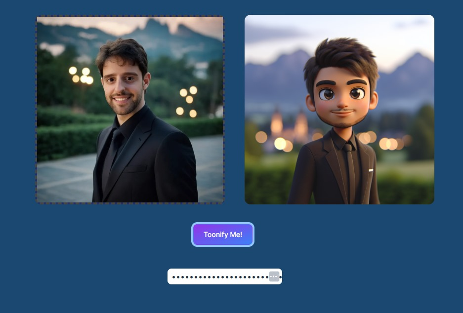

# Toonify your images

A Weekend hackton project to generate cartoon version of an image.

[Live Demo](https://toonify.netlify.app/)



# Setup

```
npm i
```
# Development Server

```
npm run dev
```

# Build for Production

```
npm run build
```

## Tech Stack
- React
- TypeScript
- Vite
- Redux Toolkit
- Tailwind CSS

